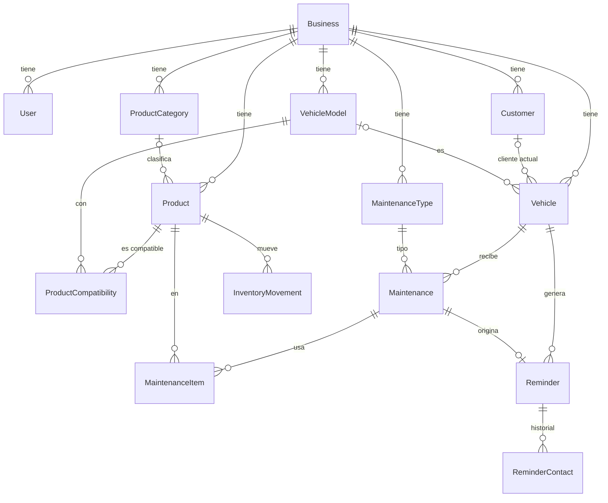

# 05 — Base de datos

**Versión:** 0.3 · **Actualizado:** 2026-09-21
PostgreSQL + Prisma. Modelo **conceptual**; el esquema Prisma se escribe en la implementación. Etiquetas: ver `03-BUSINESS-RULES.md`. Las reglas viven en `03`; aquí solo se indica cómo se guardan.

## 1. Convenciones [TÉCNICO]

- Clave primaria UUID (el cliente puede generarlo; ver `04-ARCHITECTURE.md` §7).
- Toda tabla de negocio tiene `businessId`. Las restricciones de unicidad son **por negocio**, excepto `User.username`, que es única **globalmente** (DEC-25): es lo que permite resolver el negocio en `/auth/login` sin que el cliente lo indique.
- Campos comunes: `createdAt`, `updatedAt`, `createdById`.
- Desactivación (`isActive`) en clientes, vehículos, productos y modelos. Anulación (`status`) en mantenimientos. **Sin borrado físico** de registros de negocio (BR-G5).
- Fechas de hecho (`performedAt`, `occurredAt`) separadas de `createdAt`.
- Cantidades: decimales, para no cerrar ninguna opción de unidad (BR-P15).
- Dinero: decimal. Ningún precio se asume; todos son opcionales en el MVP.

## 2. Diagrama (MVP)

## 3. Tablas del MVP

### Business
| Campo | Notas |
|---|---|
| id, name, slug | `slug` único |
| timezone | Zona horaria (para fechas de recordatorio) |
| currency | Moneda del negocio. Valor a confirmar en el seed |
| defaultCountryCode | Para armar el enlace de WhatsApp (BR-W5). Valor a confirmar tras P-01 |
| reminderLeadDays | **Nulo hasta que se decida** (BR-R5, DEC-03) |
| defaultDueRuleWhenBoth | `ANY` \| `ALL` \| nulo. **Nulo hasta que se decida** (BR-M5, DEC-01) |
| insufficientStockPolicy | `ALLOW_WITH_WARNING` \| `BLOCK`. Valor provisional: `ALLOW_WITH_WARNING` (BR-P11, BR-P12, DEC-05) |
| whatsappTemplate | Nulo hasta P-13 (BR-W4) |

Cada punto abierto es **una columna de configuración**, no una estructura: decidirlo después es cambiar un valor.

### User
`id, businessId, name, username (único global, DEC-25), passwordHash, role, isActive`. En el MVP el único rol es `OWNER` (P-12 sin responder). Agregar otro rol es una migración de un valor, no de estructura.

### Customer
`id, businessId, name?, phone?, notes?, isActive`. Ningún campo obligatorio salvo el id (BR-C3).

### VehicleModel
`id, businessId, make, model, yearFrom?, yearTo?, engineNote?, isActive`. Año y motor son opcionales: el nivel de detalle de la compatibilidad se define con datos (BR-F6).

### Vehicle
| Campo | Notas |
|---|---|
| id, businessId | |
| plate | Como fue escrita |
| plateNormalized | Mayúsculas, sin espacios ni guiones. **Único con `businessId`** (BR-C6) |
| customerId? | Opcional (BR-C4) |
| vehicleModelId? | Opcional |
| year?, color?, notes? | Opcionales |
| isActive | |

El "último km conocido" **se calcula** desde el mantenimiento activo más reciente con km. No se guarda.

### ProductCategory
`id, businessId, name`. Semilla: **Lubricante** y **Filtro** (BR-P18).

### Product
| Campo | Notas |
|---|---|
| id, businessId | |
| categoryId? | |
| brand? | Texto libre. Marcas confirmadas: Repsol, Vistony, Valvoline (C-10) |
| code? | Código (los filtros se manejan por código, C-05). Único por negocio si existe |
| name | |
| unit | Unidad en la que se cuenta y descuenta (BR-P15). Vocabulario a definir con P-07 |
| salePrice? | Opcional. Se usará en la Fase 2 |
| tracksStock | Por defecto `true` (BR-P16) |
| isActive | |

Cada fila es una **unidad de stock**. Cómo se representan presentaciones y granel queda para DEC-22; con esta estructura, ambas opciones son solo datos.

### ProductCompatibility
`id, businessId, productId, vehicleModelId, confirmedById, confirmedAt, note?`. Único `(productId, vehicleModelId)`. Solo se crea por acción explícita (BR-F1, BR-F2). No hay campos de "inferido" ni "confianza".

### MaintenanceType
`id, businessId, name, isActive`. Semilla: "Cambio de aceite" (BR-M13).

### Maintenance
| Campo | Notas |
|---|---|
| id, businessId, vehicleId, maintenanceTypeId | |
| performedAt | Cuándo se hizo |
| odometerKm? | Opcional |
| nextDueKm?, nextDueDate? | Opcionales (BR-M2) |
| dueRule? | `KM`, `DATE`, `ANY`, `ALL`. Nulo si no hay próximo mantenimiento (BR-M4) |
| notes? | |
| status | `ACTIVE` \| `VOIDED` |
| voidedAt?, voidedById?, voidReason? | Al anular (BR-M12) |

Coherencia: `KM` exige `nextDueKm`; `DATE` exige `nextDueDate`; `ANY`/`ALL` exigen ambos.
No hay precios ni totales en el MVP: cómo se cobra un cambio de aceite es P-09 y se resuelve en la Fase 2.

### MaintenanceItem
`id, maintenanceId, productId, productNameSnapshot, productCodeSnapshot?, quantity`. `quantity > 0`.

### InventoryMovement
| Campo | Notas |
|---|---|
| id, businessId, productId | |
| type | `COUNT`, `PURCHASE_IN`, `MAINTENANCE_USE`, `MAINTENANCE_VOID`, `ADJUSTMENT`, y los definidos `SALE`, `SALE_VOID` (salidas por venta; punto de entrada según DEC-24) (BR-P4, BR-P14) |
| quantityDelta | Con signo. Entra +, sale − |
| countedQuantity? | Solo en `COUNT`: la cantidad contada |
| previousBalance? | Solo en `COUNT`: saldo calculado justo antes, para auditar la diferencia |
| reason? | Obligatorio en `ADJUSTMENT` (BR-P10) |
| refType?, refId? | Origen (por ejemplo, el mantenimiento) |
| occurredAt | |

**Solo se insertan filas; nunca se actualizan ni se borran** (BR-G5, BR-P3).

**Invariantes:**
1. `saldo(producto) = Σ quantityDelta`.
2. En un `COUNT`, `quantityDelta = countedQuantity − previousBalance`, de modo que el saldo posterior es igual a la cantidad contada.
3. Un producto está "con conteo inicial" si tiene al menos un `COUNT` (BR-P8).
4. `MAINTENANCE_USE` y `MAINTENANCE_VOID` nacen en la misma transacción que el mantenimiento o su anulación (BR-M10).

El saldo se calcula por suma. Con el volumen esperado del negocio no se necesita una columna de saldo guardada; si el rendimiento lo exigiera, se agrega después sin cambiar los movimientos.

### Reminder
| Campo | Notas |
|---|---|
| id, businessId, vehicleId, maintenanceTypeId | |
| sourceMaintenanceId | Mantenimiento que lo originó |
| dueDate?, dueKm?, dueRule | Copiados del mantenimiento |
| status | `PENDING`, `CONTACTED`, `DONE`, `DISMISSED` (BR-R7) |
| closedByMaintenanceId?, closedAt?, closeReason? | `closeReason`: cumplido, descartado o mantenimiento anulado |

Un solo recordatorio abierto (`PENDING`/`CONTACTED`) por `(businessId, vehicleId, maintenanceTypeId)` (BR-R2). "Corresponde avisar ahora" se **calcula en la consulta**, no se guarda (BR-R3, R4, R6).

### ReminderContact
`id, reminderId, userId, channel (WHATSAPP_LINK), openedAt, messageSnapshot`. Historial de enlaces abiertos (BR-W6). No prueba que se haya enviado (BR-W2).

### IdempotencyRecord
`businessId, key, endpoint, requestHash, responseStatus, responseBody, createdAt`. Único `(businessId, key)`. Sirve a todas las escrituras críticas (mantenimientos e inventario), por eso no es una columna de `Maintenance`. Se purga tras un plazo técnico.

## 4. Tablas de la Fase 2 (no se crean en el MVP)

| Tabla | Idea |
|---|---|
| Sale, SaleLine | Venta con líneas de producto o servicio. Cliente y vehículo opcionales |
| PaymentMethod, Payment | Métodos sembrados: **Efectivo** y **Yape** (C-17). Otros: P-09 |
| WashType | Tipos de lavado y precio por tipo de vehículo. Valores: P-10 |
| WashRecord | Registro rápido opcional. Sin estados (BR-L1). Placa opcional |
| DailyClose | Resumen del día. Conteos manuales: DEC-15 |

Los movimientos de venta usan `InventoryMovement` con los tipos `SALE` y `SALE_VOID`, ya definidos en el MVP (BR-P14). Las tablas de arriba solo agregan el documento de venta (precio, pago); el libro de inventario no cambia.

## 5. Índices y restricciones clave [TÉCNICO]

- `Vehicle(businessId, plateNormalized)` único; índice para búsqueda parcial por placa.
- `Customer(businessId, phone)` no único.
- `Product(businessId, code)` único si `code` no es nulo.
- `ProductCompatibility(productId, vehicleModelId)` único.
- `Maintenance(businessId, vehicleId, performedAt desc)`.
- `InventoryMovement(businessId, productId, occurredAt)`.
- `Reminder(businessId, status)` y único parcial `(businessId, vehicleId, maintenanceTypeId)` para recordatorios abiertos.
- `IdempotencyRecord(businessId, key)` único.
- Todas las claves foráneas dentro del mismo `businessId`. Las pruebas de aislamiento lo verifican (`04-ARCHITECTURE.md` §10).

## 6. Migraciones y datos iniciales

- Migraciones versionadas con Prisma.
- Semilla de Brigith: negocio, usuario dueño, categorías Lubricante y Filtro, tipo "Cambio de aceite". Semilla del negocio "demo" para pruebas (BR-G7).
- **No se siembra** ningún intervalo de mantenimiento, plantilla de mensaje, precio, producto, código de filtro ni compatibilidad.
- Carga de productos, clientes y vehículos reales: depende de P-01, P-07 y P-08.

## 7. Cómo se cierran los puntos abiertos sin rehacer el modelo

| Punto abierto | Dónde se resuelve |
|---|---|
| DEC-01 regla con km y fecha | `Business.defaultDueRuleWhenBoth` |
| DEC-03 anticipación | `Business.reminderLeadDays` |
| DEC-05 stock insuficiente | `Business.insufficientStockPolicy` |
| DEC-07 detalle de compatibilidad | Datos de `VehicleModel` (año/motor opcionales) |
| DEC-21 carga del stock inicial | Proceso de uso; el modelo (`COUNT`) ya soporta ambas |
| DEC-22 presentaciones y unidades | Datos de `Product.unit` y filas de `Product` |
| P-12 otros usuarios | Nuevo valor de `User.role` |
| P-17 otros mantenimientos | Filas de `MaintenanceType` |
| P-13 mensaje | `Business.whatsappTemplate` |
